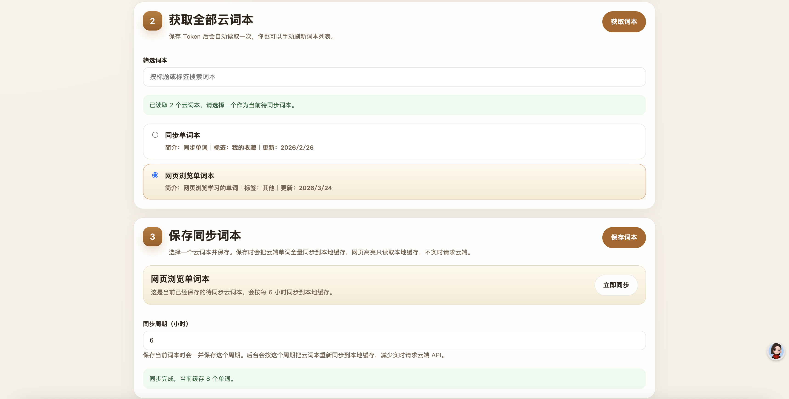
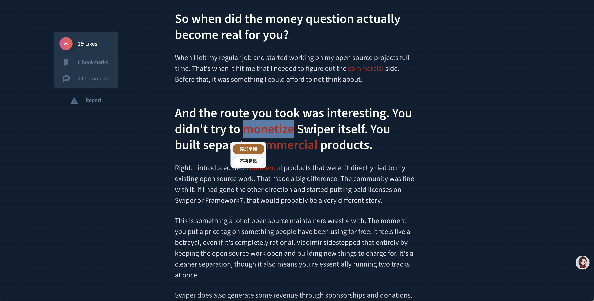

# maimemo-chrome

> 基于墨墨背单词的 Chrome 扩展。  
> 在网页中选中英文单词后，可以一键加入墨墨云词本，并对当前云词本中的单词进行本地高亮。
> 本项目是基于墨墨开放 API 构建的第三方开源工具，仅用于学习和研究。

<table>
  <tr>
    <td align="center">
      
    </td>
    <td align="center">
      
    </td>
  </tr>
</table>

## 功能

- 右键把选中的单词或词组加入当前云词本
- 双击或拖选后弹出快捷面板
- 支持 `添加单词`
- 支持 `不再标记`
- 本地缓存云词本，避免浏览时实时请求云端
- 网页高亮只保留红字样式，尽量减少干扰

## 使用流程

1. 在设置页填写并保存墨墨开放 API Token
2. 获取全部云词本
3. 选择一个词本作为当前同步词本
4. 保存后自动同步到本地缓存
5. 浏览网页时高亮缓存中的单词或词组

## 安装

### Chrome

1. 打开 `chrome://extensions/`
2. 打开“开发者模式”
3. 点击“加载已解压的扩展程序”
4. 选择项目根目录 `maimemo-chrome/`

### 设置

安装后打开扩展设置页，完成：

- 保存 Token
- 获取云词本
- 选择当前同步词本
- 设置同步周期

## 权限说明

- `storage`：保存 Token、同步设置、本地缓存和不标记名单
- `alarms`：按周期同步当前云词本
- `contextMenus`：提供右键添加能力
- `https://open.maimemo.com/*`：访问墨墨开放 API
- `<all_urls>`：在网页中执行本地高亮和快捷操作

网页内容不会被上传；浏览时的高亮匹配在本地完成。

## 项目结构

```text
maimemo-chrome/
├── manifest.json
├── background.js
├── content.js
├── content.css
├── options.html
├── options.js
├── maimemo.js
├── shared.js
└── docs/images/
```

## License

[MIT](./LICENSE)
